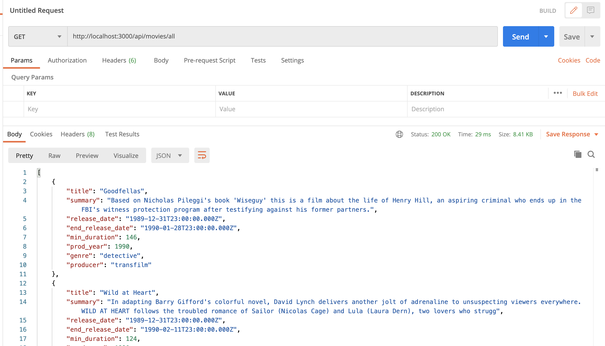
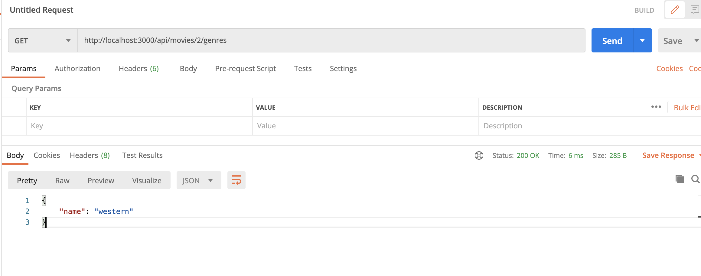
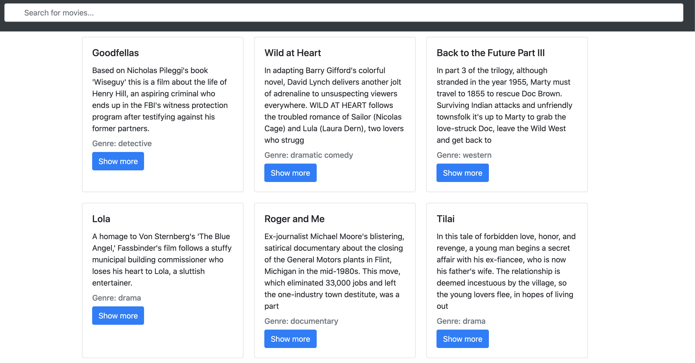

# Allô Movies 
This project is a Node.js Restful CRUD API using  Node.JS/Express.JS and interacting with MySQL database.

## Project setup
### MySQL
The installation instructions can be found at [Official MySQL installation manual.](https://dev.mysql.com/doc/refman/5.7/en/installing.html) 

### install every dependencies in package.json file
```
npm install
```
### Run our Node.js application with command: 
```
node server.js    
```
The console shows:
```
Server is running on port 3000.
Successfully connected to the database.
```

### Show all your movies with
```
index.html 
```

## Presentation
You can use Postman to test all the Apis. In this project I only create GET routes.
### This route enables to access to all movies of the DB
 

### This route enables to access to the genre of one specifique movie with id = 2
 

## Basic HTML to display these informations

## Home page with search bar
 

## Modal
 

## Frameworks 
ExpressJS, NodeJS, bootstrap CSS
